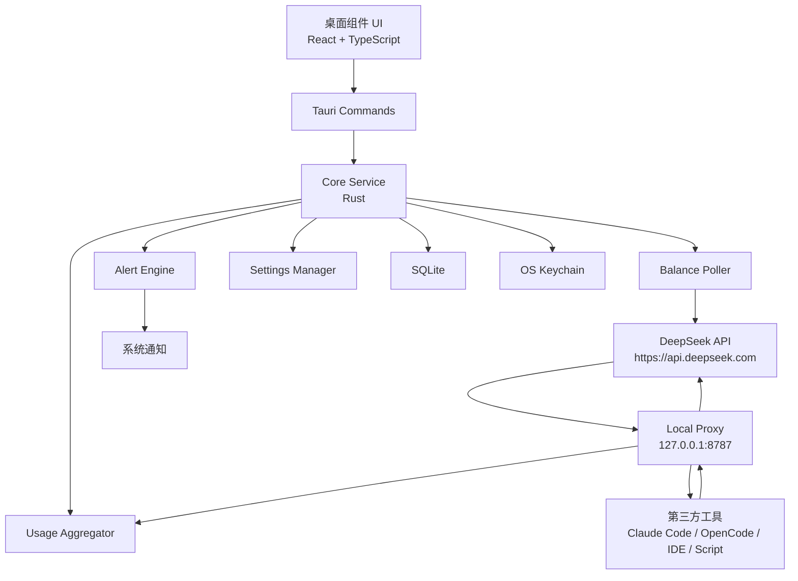
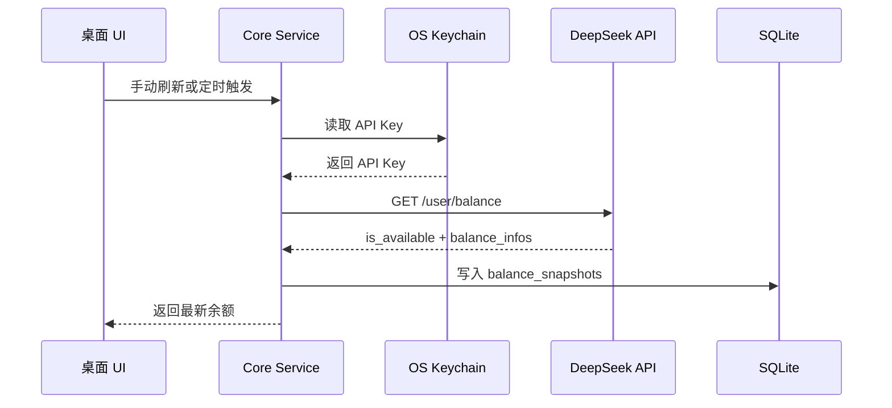
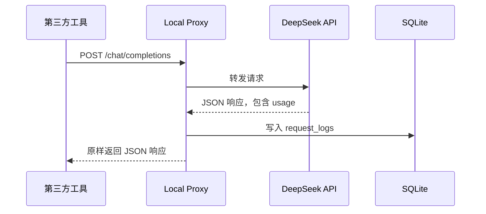
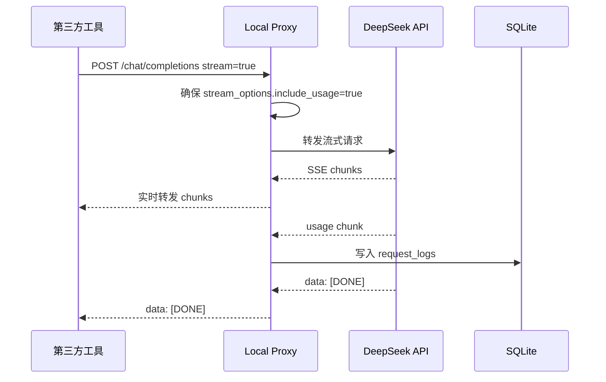

# DeepSeek API 用量与余额桌面组件详细设计文档

> 文档版本：v1.0  
> 更新时间：2026-05-06  
> 设计目标：为个人或小团队提供一个可常驻桌面的 DeepSeek API 余额与用量监控组件，支持实时余额、今日用量、按模型统计、低余额提醒，以及通过本地代理统计第三方工具调用量。

---

## 目录

1. [背景与问题](#1-背景与问题)
2. [设计目标](#2-设计目标)
3. [非目标](#3-非目标)
4. [官方能力与约束](#4-官方能力与约束)
5. [总体方案](#5-总体方案)
6. [系统架构](#6-系统架构)
7. [核心模块设计](#7-核心模块设计)
8. [关键数据流](#8-关键数据流)
9. [DeepSeek API 对接设计](#9-deepseek-api-对接设计)
10. [本地代理设计](#10-本地代理设计)
11. [数据模型设计](#11-数据模型设计)
12. [用量与费用计算](#12-用量与费用计算)
13. [桌面组件 UI 设计](#13-桌面组件-ui-设计)
14. [配置项设计](#14-配置项设计)
15. [安全设计](#15-安全设计)
16. [错误处理与降级策略](#16-错误处理与降级策略)
17. [性能与刷新策略](#17-性能与刷新策略)
18. [日志与可观测性](#18-日志与可观测性)
19. [测试方案](#19-测试方案)
20. [部署与发布](#20-部署与发布)
21. [里程碑计划](#21-里程碑计划)
22. [验收标准](#22-验收标准)
23. [风险与应对](#23-风险与应对)
24. [后续扩展](#24-后续扩展)
25. [附录](#25-附录)
26. [参考资料](#26-参考资料)

---

## 1. 背景与问题

DeepSeek API 适合被 IDE、Agent 工具、脚本、自动化任务和自研应用调用。实际使用过程中，常见问题包括：

1. 不方便随时查看 API 账户余额。
2. 多个工具共用一个 API Key，难以知道具体是谁消耗了额度。
3. 官方余额可查询，但历史用量更偏向平台页面或导出文件，不适合桌面实时展示。
4. 调用失败、低余额、突增消耗缺少本地提醒。
5. 第三方工具通常只配置 `base_url` 和 `api_key`，如果不接管请求链路，很难获得每次请求的 `usage` 明细。

因此，本项目设计一个本地桌面组件：一方面直接调用 DeepSeek 余额接口；另一方面通过本地代理捕获每次请求响应中的 `usage` 字段，形成可实时查看、可追踪、可导出的本地用量账本。

---

## 2. 设计目标

### 2.1 产品目标

- 常驻桌面或系统托盘，实时展示 DeepSeek API 余额。
- 展示今日请求数、今日 token、今日预估费用、最近 1 小时消耗。
- 支持低余额提醒、异常消耗提醒。
- 支持多 API Key 管理。
- 支持按模型、按调用来源、按时间范围统计用量。
- 支持第三方工具通过本地代理接入。
- 支持导出 CSV / JSON。

### 2.2 技术目标

- 余额查询走官方 `/user/balance`。
- 用量统计优先从 DeepSeek API 响应中的 `usage` 字段采集。
- 流式请求自动启用或透传 `stream_options.include_usage = true`。
- 数据本地存储，默认不上传任何调用日志。
- API Key 不进入前端渲染层，不写明文配置文件。
- 本地代理默认仅监听 `127.0.0.1`。
- 架构可跨平台：macOS、Windows、Linux。

### 2.3 推荐技术栈

- 桌面框架：Tauri 2.x
- 前端：React + TypeScript
- 后端：Rust
- 本地数据库：SQLite
- Key 存储：系统钥匙串 / Credential Manager / Secret Service
- 图表：ECharts / Recharts / Chart.js
- 本地代理：Rust HTTP server，例如 Axum / Hyper

---

## 3. 非目标

第一版不解决以下问题：

- 不破解或模拟 DeepSeek 控制台页面。
- 不抓浏览器登录态。
- 不保存完整 prompt / completion 内容。
- 不替代 DeepSeek 官方账单系统。
- 不保证与官方月度账单 100% 对齐；本地统计以经过本地代理的请求为准。
- 不监控未经过本地代理的第三方工具调用明细，只能通过余额差额估算。
- 不提供云端团队协作后台。

---

## 4. 官方能力与约束

### 4.1 余额接口

DeepSeek 官方提供查询账户余额接口：

```http
GET https://api.deepseek.com/user/balance
Authorization: Bearer <DEEPSEEK_API_KEY>
```

返回字段包括：

- `is_available`：当前账户是否有余额可供 API 调用。
- `balance_infos[]`
  - `currency`：`CNY` 或 `USD`
  - `total_balance`：总可用余额
  - `granted_balance`：未过期赠金余额
  - `topped_up_balance`：充值余额

### 4.2 API 兼容性

DeepSeek API 使用 OpenAI / Anthropic 兼容格式。OpenAI 格式的 `base_url` 为：

```text
https://api.deepseek.com
```

Anthropic 格式的 `base_url` 为：

```text
https://api.deepseek.com/anthropic
```

这意味着本地代理可以模拟 OpenAI 兼容 API 入口，让第三方工具把 `base_url` 改为本地地址，从而统计调用。

### 4.3 用量字段

非流式 Chat Completion 响应中包含 `usage` 字段，常见字段包括：

```json
{
  "usage": {
    "completion_tokens": 10,
    "prompt_tokens": 16,
    "total_tokens": 26
  }
}
```

官方 Schema 中也可能包含：

```json
{
  "completion_tokens": 0,
  "prompt_tokens": 0,
  "prompt_cache_hit_tokens": 0,
  "prompt_cache_miss_tokens": 0,
  "total_tokens": 0,
  "completion_tokens_details": {
    "reasoning_tokens": 0
  }
}
```

### 4.4 流式 usage

当 `stream=true` 时，可设置：

```json
{
  "stream": true,
  "stream_options": {
    "include_usage": true
  }
}
```

在 `data: [DONE]` 之前会额外返回一个包含本次请求 usage 的 chunk。其他流式 chunk 的 `usage` 通常为 `null`。

### 4.5 历史用量限制

官方 FAQ 给出的“分 key 查看用量”路径是：登录开放平台，进入“用量信息”页面，选择月份导出，解压后查看 `amount` CSV。本文不假设存在公开的“历史用量查询 REST API”。

因此，桌面组件需要自己累计本地用量；官方导出的 CSV 可作为人工对账输入。

---

## 5. 总体方案

系统采用“桌面 App + 本地后台服务 + 本地代理 + SQLite”的组合。

### 5.1 最小可用方案

只做余额监控：

```text
桌面组件
  └── 定时请求 DeepSeek /user/balance
      └── 展示 total_balance / is_available / 最近刷新时间
```

优点：开发快。  
缺点：无法知道具体用量，只能看到余额变化。

### 5.2 推荐完整方案

```text
第三方工具 / 自研脚本
        │
        │ base_url = http://127.0.0.1:8787
        ▼
本地 DeepSeek 代理服务
        │
        ├── 转发请求到 https://api.deepseek.com
        ├── 捕获响应 usage
        ├── 写入 SQLite
        └── 返回原始响应给调用方
        │
        ▼
桌面组件 UI
        ├── 查询余额
        ├── 查询本地用量统计
        ├── 展示趋势图
        └── 发出系统通知
```

优点：

- 能统计经过代理的所有请求。
- 能给 Claude Code、OpenCode、Cherry Studio、NextChat 等支持自定义 base_url 的工具接入。
- API Key 可以集中保存在本地后台，减少泄漏风险。
- 可以做细粒度统计和提醒。

---

## 6. 系统架构



### 6.1 进程模型

推荐单应用进程内启动三个逻辑服务：

1. UI WebView
2. Tauri 后端 Core Service
3. 本地 HTTP Proxy

也可以拆成：

- `deepseek-monitor-app`：桌面 UI
- `deepseek-monitor-agent`：本地后台代理服务

第一版建议单进程，降低安装复杂度。

---

## 7. 核心模块设计

### 7.1 Desktop UI

职责：

- 展示余额、用量、趋势。
- 配置 API Key、刷新频率、代理端口。
- 展示代理连接状态。
- 展示低余额提醒和错误状态。
- 导出统计数据。

页面：

1. 首页 Dashboard
2. 用量明细 Usage
3. 模型统计 Models
4. API Key 管理 Keys
5. 代理设置 Proxy
6. 告警设置 Alerts
7. 数据导入导出 Data

### 7.2 Core Service

职责：

- 维护应用状态。
- 调用 DeepSeek 余额接口。
- 管理数据库连接。
- 管理系统通知。
- 暴露 Tauri command 给前端。
- 管理 Keychain 读写。

核心接口：

```ts
getDashboardSummary(): Promise<DashboardSummary>
getBalance(): Promise<BalanceSnapshot>
getUsageStats(range: TimeRange): Promise<UsageStats>
saveApiKey(alias: string, apiKey: string): Promise<void>
startProxy(config: ProxyConfig): Promise<void>
stopProxy(): Promise<void>
exportUsage(format: "csv" | "json", range: TimeRange): Promise<string>
```

### 7.3 Balance Poller

职责：

- 按配置间隔查询 `/user/balance`。
- 写入 `balance_snapshots`。
- 更新 UI 状态。
- 触发低余额告警。

策略：

- 默认每 60 秒刷新一次。
- 用户手动点击刷新时立即请求。
- 网络错误时指数退避，最多退避到 5 分钟。
- 当窗口隐藏但系统托盘运行时，继续按低频刷新。

### 7.4 Local Proxy

职责：

- 接收 OpenAI 兼容请求。
- 将请求转发至 DeepSeek。
- 对响应进行透明代理。
- 捕获 `usage`。
- 记录请求元数据。
- 支持流式 SSE 解析。

代理默认地址：

```text
http://127.0.0.1:8787
```

可选代理鉴权：

```http
X-Local-Proxy-Token: <random-local-token>
```

### 7.5 Usage Aggregator

职责：

- 写入每次请求明细。
- 计算每日、每小时、按模型聚合。
- 根据 pricing rules 计算预估费用。
- 与余额快照做差额对账。

### 7.6 Alert Engine

告警类型：

- 余额低于阈值。
- 近 1 小时消耗超过阈值。
- 单次请求 token 过大。
- API 返回 401 / 429 / 503。
- 代理长时间没有 usage 数据。
- 余额接口连续失败。

### 7.7 Key Manager

职责：

- API Key 仅存系统安全存储。
- 数据库只保存 Key 别名和脱敏指纹。
- 前端永远不能直接读取完整 API Key。

Key 指纹示例：

```text
sk-********************abcd
sha256_prefix = first_12_chars(sha256(api_key))
```

---

## 8. 关键数据流

### 8.1 余额刷新流程



### 8.2 非流式请求用量采集



### 8.3 流式请求用量采集



### 8.4 第三方工具接入流程

用户将第三方工具的配置从：

```text
base_url = https://api.deepseek.com
api_key = sk-xxxx
```

改为：

```text
base_url = http://127.0.0.1:8787
api_key = 任意占位符或本地代理 token
```

本地代理实际使用系统钥匙串中的 DeepSeek API Key 转发请求。

兼容性注意：

- 某些工具强制要求 `api_key` 非空，可填写本地代理 token。
- 某些工具不允许 HTTP，只允许 HTTPS，则需要用户继续直连，无法采集 usage，只能余额估算。
- 某些工具不支持自定义 base_url，无法接入代理。

---

## 9. DeepSeek API 对接设计

### 9.1 余额接口请求

```http
GET /user/balance HTTP/1.1
Host: api.deepseek.com
Authorization: Bearer <DEEPSEEK_API_KEY>
```

### 9.2 余额接口响应模型

```ts
interface DeepSeekBalanceResponse {
  is_available: boolean;
  balance_infos: Array<{
    currency: "CNY" | "USD";
    total_balance: string;
    granted_balance: string;
    topped_up_balance: string;
  }>;
}
```

### 9.3 Chat Completion usage 模型

```ts
interface DeepSeekUsage {
  completion_tokens?: number;
  prompt_tokens?: number;
  prompt_cache_hit_tokens?: number;
  prompt_cache_miss_tokens?: number;
  total_tokens?: number;
  completion_tokens_details?: {
    reasoning_tokens?: number;
  };
}
```

### 9.4 请求头策略

对外请求 DeepSeek 时：

```http
Authorization: Bearer <DEEPSEEK_API_KEY>
Content-Type: application/json
```

对本地调用方返回时：

- 默认透传 DeepSeek 原始状态码。
- 默认透传 DeepSeek 原始 body。
- 可选增加本地调试响应头：

```http
X-DeepSeek-Monitor-Request-Id: <local_request_id>
X-DeepSeek-Monitor-Usage-Captured: true
```

正式版默认不添加额外响应头，避免影响兼容性。

---

## 10. 本地代理设计

### 10.1 代理路径

第一版支持：

```text
POST /chat/completions
GET  /models
GET  /user/balance
```

第二版支持：

```text
POST /v1/chat/completions
GET  /v1/models
GET  /v1/user/balance
POST /anthropic/v1/messages
```

路径映射：

| 本地路径 | DeepSeek 路径 | 说明 |
|---|---|---|
| `/chat/completions` | `/chat/completions` | OpenAI 兼容对话 |
| `/v1/chat/completions` | `/chat/completions` | 兼容带 `/v1` 的客户端 |
| `/models` | `/models` | 模型列表 |
| `/v1/models` | `/models` | 兼容 OpenAI SDK |
| `/user/balance` | `/user/balance` | 余额查询 |

### 10.2 请求处理原则

- 不修改用户 prompt。
- 不保存 prompt 和 completion 正文。
- 可以注入 `stream_options.include_usage=true`，仅用于流式 usage 统计。
- 对请求 body 做大小限制，默认 20 MB。
- 对本地连接数做限制，默认 32 并发。
- 对 DeepSeek 返回的错误原样转发。

### 10.3 流式 SSE 处理

伪代码：

```ts
async function handleStream(responseStream) {
  for await (const line of responseStream) {
    forwardToClient(line);

    if (!line.startsWith("data: ")) continue;

    const payload = line.slice("data: ".length).trim();

    if (payload === "[DONE]") {
      finishRequest();
      continue;
    }

    const chunk = JSON.parse(payload);

    if (chunk.usage) {
      captureUsage(chunk.usage);
    }
  }
}
```

注意：

- 不要等完整响应结束后再返回给客户端，否则破坏流式体验。
- 逐行解析 SSE，同时逐行转发。
- JSON 解析失败不能中断主链路，应记录 warning 后继续透传。
- 如果最终未捕获 usage，应写入一条 `usage_missing` 记录。

### 10.4 请求来源识别

来源识别优先级：

1. 用户手动为本地代理 endpoint 分配 `source_name`。
2. 请求头 `User-Agent`。
3. 请求头 `X-Client-Name`。
4. 本地端口 / 进程名探测（可选，高权限，不建议第一版做）。
5. 默认为 `unknown`。

---

## 11. 数据模型设计

数据库：SQLite  
时间字段统一存 UTC ISO8601，UI 按本地时区展示。

### 11.1 `api_keys`

保存 API Key 元信息，不保存明文 Key。

```sql
CREATE TABLE api_keys (
  id TEXT PRIMARY KEY,
  alias TEXT NOT NULL,
  provider TEXT NOT NULL DEFAULT 'deepseek',
  key_fingerprint TEXT NOT NULL,
  keychain_ref TEXT NOT NULL,
  currency TEXT,
  is_active INTEGER NOT NULL DEFAULT 1,
  created_at TEXT NOT NULL,
  updated_at TEXT NOT NULL
);
```

### 11.2 `balance_snapshots`

```sql
CREATE TABLE balance_snapshots (
  id TEXT PRIMARY KEY,
  api_key_id TEXT NOT NULL,
  captured_at TEXT NOT NULL,
  is_available INTEGER NOT NULL,
  currency TEXT NOT NULL,
  total_balance TEXT NOT NULL,
  granted_balance TEXT NOT NULL,
  topped_up_balance TEXT NOT NULL,
  raw_json TEXT,
  error_code TEXT,
  error_message TEXT,
  FOREIGN KEY(api_key_id) REFERENCES api_keys(id)
);

CREATE INDEX idx_balance_snapshots_time
ON balance_snapshots(api_key_id, captured_at);
```

### 11.3 `request_logs`

```sql
CREATE TABLE request_logs (
  id TEXT PRIMARY KEY,
  api_key_id TEXT NOT NULL,
  source_name TEXT,
  provider TEXT NOT NULL DEFAULT 'deepseek',
  endpoint TEXT NOT NULL,
  method TEXT NOT NULL,
  model TEXT,
  request_started_at TEXT NOT NULL,
  request_finished_at TEXT,
  duration_ms INTEGER,
  status_code INTEGER,
  success INTEGER NOT NULL DEFAULT 0,
  stream INTEGER NOT NULL DEFAULT 0,

  prompt_tokens INTEGER,
  completion_tokens INTEGER,
  total_tokens INTEGER,
  prompt_cache_hit_tokens INTEGER,
  prompt_cache_miss_tokens INTEGER,
  reasoning_tokens INTEGER,

  estimated_cost TEXT,
  currency TEXT,
  usage_captured INTEGER NOT NULL DEFAULT 0,
  usage_missing_reason TEXT,

  request_hash TEXT,
  error_code TEXT,
  error_message TEXT,

  created_at TEXT NOT NULL,
  FOREIGN KEY(api_key_id) REFERENCES api_keys(id)
);

CREATE INDEX idx_request_logs_time
ON request_logs(api_key_id, request_started_at);

CREATE INDEX idx_request_logs_model
ON request_logs(api_key_id, model, request_started_at);

CREATE INDEX idx_request_logs_source
ON request_logs(api_key_id, source_name, request_started_at);
```

### 11.4 `daily_usage`

可由 `request_logs` 计算，也可做物化表提升查询速度。

```sql
CREATE TABLE daily_usage (
  id TEXT PRIMARY KEY,
  api_key_id TEXT NOT NULL,
  usage_date TEXT NOT NULL,
  source_name TEXT,
  model TEXT,
  request_count INTEGER NOT NULL DEFAULT 0,
  prompt_tokens INTEGER NOT NULL DEFAULT 0,
  completion_tokens INTEGER NOT NULL DEFAULT 0,
  total_tokens INTEGER NOT NULL DEFAULT 0,
  reasoning_tokens INTEGER NOT NULL DEFAULT 0,
  estimated_cost TEXT,
  currency TEXT,
  updated_at TEXT NOT NULL,
  UNIQUE(api_key_id, usage_date, source_name, model)
);
```

### 11.5 `price_rules`

价格规则本地可配置，避免把价格写死到代码。

```sql
CREATE TABLE price_rules (
  id TEXT PRIMARY KEY,
  provider TEXT NOT NULL DEFAULT 'deepseek',
  model TEXT NOT NULL,
  currency TEXT NOT NULL,
  input_price_per_million TEXT NOT NULL,
  cache_hit_input_price_per_million TEXT,
  output_price_per_million TEXT NOT NULL,
  effective_from TEXT NOT NULL,
  effective_to TEXT,
  source_url TEXT,
  created_at TEXT NOT NULL,
  updated_at TEXT NOT NULL
);
```

### 11.6 `app_settings`

```sql
CREATE TABLE app_settings (
  key TEXT PRIMARY KEY,
  value TEXT NOT NULL,
  updated_at TEXT NOT NULL
);
```

常见配置：

```json
{
  "balance_refresh_interval_seconds": 60,
  "proxy_enabled": true,
  "proxy_host": "127.0.0.1",
  "proxy_port": 8787,
  "low_balance_threshold": "10.00",
  "currency": "CNY",
  "store_prompt_body": false,
  "store_completion_body": false,
  "enable_system_notification": true
}
```

### 11.7 `alert_events`

```sql
CREATE TABLE alert_events (
  id TEXT PRIMARY KEY,
  api_key_id TEXT,
  alert_type TEXT NOT NULL,
  severity TEXT NOT NULL,
  title TEXT NOT NULL,
  message TEXT NOT NULL,
  triggered_at TEXT NOT NULL,
  acknowledged_at TEXT,
  metadata_json TEXT
);
```

---

## 12. 用量与费用计算

### 12.1 token 统计

对每次请求，记录：

```text
prompt_tokens
completion_tokens
total_tokens
prompt_cache_hit_tokens
prompt_cache_miss_tokens
reasoning_tokens
```

不同模型和不同模式下字段可能不完全一致，缺失字段按 `NULL` 保存，不强制写 0。

### 12.2 费用估算

费用估算公式：

```text
input_cost =
  prompt_cache_miss_tokens / 1_000_000 * input_price_per_million
+ prompt_cache_hit_tokens  / 1_000_000 * cache_hit_input_price_per_million

output_cost =
  completion_tokens / 1_000_000 * output_price_per_million

estimated_cost = input_cost + output_cost
```

如果没有 cache hit / miss 明细：

```text
input_cost = prompt_tokens / 1_000_000 * input_price_per_million
```

### 12.3 余额差额对账

本地 usage 统计只覆盖经过代理的请求。为了发现漏统计，可以用余额快照做差额：

```text
balance_delta = previous_total_balance - current_total_balance
local_estimated_cost = sum(request_logs.estimated_cost)

untracked_cost = balance_delta - local_estimated_cost
```

展示口径：

```text
今日本地统计：¥3.21
余额实际减少：¥3.89
可能未经过代理的消耗：¥0.68
```

注意：

- 赠金、充值、退款、价格变动会影响差额。
- 余额接口返回字符串金额，计算时应使用 Decimal，不要使用 float。
- 对账只做提示，不作为官方账单依据。

### 12.4 按模型聚合

```sql
SELECT
  model,
  COUNT(*) AS request_count,
  SUM(prompt_tokens) AS prompt_tokens,
  SUM(completion_tokens) AS completion_tokens,
  SUM(total_tokens) AS total_tokens,
  SUM(CAST(estimated_cost AS DECIMAL)) AS estimated_cost
FROM request_logs
WHERE request_started_at >= :start
  AND request_started_at < :end
GROUP BY model
ORDER BY estimated_cost DESC;
```

---

## 13. 桌面组件 UI 设计

### 13.1 托盘状态

托盘标题示例：

```text
DeepSeek ¥96.42
```

余额低于阈值：

```text
DeepSeek ¥8.20 ⚠
```

API 不可用：

```text
DeepSeek Unavailable
```

### 13.2 Dashboard 布局

```text
┌──────────────────────────────────────┐
│ DeepSeek Monitor                     │
│ 余额：¥96.42     状态：可用          │
│ 赠金：¥10.00     充值：¥86.42        │
│ 最近刷新：14:31:08                   │
├──────────────────────────────────────┤
│ 今日请求：312                         │
│ 今日 Tokens：128,430                  │
│ 今日预估费用：¥3.21                   │
│ 最近 1 小时：¥0.42                    │
├──────────────────────────────────────┤
│ [打开代理设置] [手动刷新] [导出 CSV]  │
└──────────────────────────────────────┘
```

### 13.3 明细页字段

| 字段 | 说明 |
|---|---|
| 时间 | 请求开始时间 |
| 来源 | Claude Code / OpenCode / Script / unknown |
| 模型 | deepseek-v4-pro / deepseek-v4-flash |
| 类型 | stream / non-stream |
| 输入 tokens | prompt_tokens |
| 输出 tokens | completion_tokens |
| 总 tokens | total_tokens |
| 费用 | estimated_cost |
| 状态 | HTTP status |
| 耗时 | duration_ms |

### 13.4 图表

第一版图表：

- 今日每小时费用柱状图
- 最近 7 天费用折线图
- 按模型费用占比图
- 按来源请求数排行榜

### 13.5 状态颜色

| 状态 | 说明 |
|---|---|
| 正常 | 余额充足，代理正常 |
| 警告 | 余额低、usage 缺失、短时消耗高 |
| 错误 | API Key 无效、网络失败、代理端口被占用 |
| 离线 | 无网络或用户暂停刷新 |

---

## 14. 配置项设计

### 14.1 基础配置

```json
{
  "balance_refresh_interval_seconds": 60,
  "startup_on_login": true,
  "show_tray_icon": true,
  "default_currency": "CNY",
  "timezone": "Asia/Tokyo"
}
```

### 14.2 代理配置

```json
{
  "proxy_enabled": true,
  "proxy_host": "127.0.0.1",
  "proxy_port": 8787,
  "proxy_require_token": false,
  "proxy_token": "auto-generated",
  "inject_stream_usage": true,
  "max_body_size_mb": 20,
  "max_concurrent_requests": 32
}
```

### 14.3 隐私配置

```json
{
  "store_prompt_body": false,
  "store_completion_body": false,
  "store_request_hash": true,
  "redact_headers": true,
  "keep_raw_error_body": false
}
```

### 14.4 告警配置

```json
{
  "low_balance_threshold": "10.00",
  "hourly_cost_threshold": "5.00",
  "single_request_token_threshold": 100000,
  "notify_on_401": true,
  "notify_on_429": true,
  "notify_on_503": true
}
```

---

## 15. 安全设计

### 15.1 API Key 安全

要求：

- API Key 不写入 SQLite。
- API Key 不写入前端 localStorage。
- API Key 不出现在日志。
- API Key 仅由 Rust 后端通过系统安全存储读取。
- 前端只显示脱敏 Key：

```text
sk-********************abcd
```

### 15.2 本地代理安全

默认监听：

```text
127.0.0.1:8787
```

禁止默认监听：

```text
0.0.0.0
```

如用户手动开启局域网监听，必须显示强警告：

```text
警告：开启局域网监听会让同一网络下的其他设备可能访问你的本地代理。
请务必开启本地代理 token，并确认防火墙规则。
```

### 15.3 数据隐私

默认不存：

- prompt 正文
- completion 正文
- 请求完整 body
- 响应完整 body
- Authorization header

默认存：

- 模型名
- token 数
- HTTP 状态码
- 耗时
- 来源
- 时间
- request hash

### 15.4 Prompt Hash

为了排查重复请求，可对请求 body 做 hash：

```text
request_hash = sha256(canonical_json_without_sensitive_headers)
```

hash 不能还原正文，只用于聚合和去重。

---

## 16. 错误处理与降级策略

### 16.1 余额接口错误

| 错误 | 处理 |
|---|---|
| 401 | 标记 API Key 无效，通知用户重新配置 |
| 403 | 标记权限异常，提示检查账号状态 |
| 429 | 进入退避，保持上次余额显示 |
| 5xx | 进入退避，展示“余额刷新失败” |
| 网络失败 | 展示离线状态，继续重试 |
| JSON 解析失败 | 记录错误，提示接口响应异常 |

### 16.2 代理请求错误

原则：

- DeepSeek 返回什么，代理尽量原样返回什么。
- 代理自身错误才返回本地错误。
- 代理不能因为统计失败影响主请求。

本地代理错误示例：

```json
{
  "error": {
    "message": "Local proxy failed to read DeepSeek API key from keychain",
    "type": "local_proxy_error",
    "code": "KEYCHAIN_READ_FAILED"
  }
}
```

### 16.3 usage 缺失

usage 缺失原因：

- 客户端未启用流式 usage。
- 模型或 endpoint 不返回 usage。
- SSE 解析异常。
- 请求失败，无 usage。
- 请求未经过本地代理。

处理：

- `usage_captured = 0`
- `usage_missing_reason` 填入原因
- UI 明细页显示“未捕获”
- Dashboard 显示“本地统计可能不完整”

### 16.4 端口占用

如果 `8787` 被占用：

1. 自动尝试 `8788`、`8789`。
2. UI 提示实际代理地址。
3. 提供“复制配置”按钮。
4. 用户可手动固定端口。

---

## 17. 性能与刷新策略

### 17.1 刷新频率

| 数据 | 默认频率 | 说明 |
|---|---:|---|
| 余额 | 60 秒 | 用户可改为 30 秒到 10 分钟 |
| Dashboard 聚合 | 5 秒 | 从本地 SQLite 读取 |
| 图表数据 | 30 秒 | UI 可缓存 |
| 代理状态 | 5 秒 | 本地心跳 |
| 告警检测 | 10 秒 | 本地计算 |

### 17.2 数据量估算

假设每天 10,000 次请求：

- `request_logs` 每天约 10,000 行
- 每行 1 KB 以内
- 每月约 300 MB 以内

第一版无需复杂分区。  
可提供自动清理策略：

```text
保留明细：180 天
保留日聚合：永久
导出后可删除明细
```

### 17.3 性能优化

- Dashboard 使用聚合查询或物化表。
- 写日志使用异步队列。
- 流式代理不能阻塞转发。
- 数据库写入失败不能影响 API 主链路。
- 大请求不读取完整 body 到内存，尽量流式处理；但第一版为了兼容 JSON 修改，Chat Completion 请求可限制 body 大小。

---

## 18. 日志与可观测性

### 18.1 日志级别

| 级别 | 内容 |
|---|---|
| ERROR | 代理启动失败、Keychain 失败、数据库失败 |
| WARN | usage 缺失、余额刷新失败、SSE 解析失败 |
| INFO | 应用启动、代理启动、余额刷新成功 |
| DEBUG | 本地开发调试信息，默认关闭 |

### 18.2 日志脱敏

必须脱敏：

- Authorization
- API Key
- prompt 正文
- completion 正文
- Cookie
- 本地代理 token

### 18.3 本地诊断包

用户可导出诊断包：

```text
diagnostics.zip
  ├── app.log
  ├── settings.redacted.json
  ├── db_stats.json
  └── recent_errors.json
```

不包含：

- API Key
- prompt
- completion
- 原始请求 body

---

## 19. 测试方案

### 19.1 单元测试

- 余额响应解析。
- usage 响应解析。
- 流式 SSE usage 解析。
- Decimal 金额计算。
- 费用估算。
- Key 脱敏。
- 日聚合计算。
- 告警规则。

### 19.2 集成测试

- 代理转发非流式请求。
- 代理转发流式请求。
- 代理注入 `stream_options.include_usage`。
- DeepSeek 返回 401 时原样转发。
- 数据库写入失败时不影响主请求。
- 端口占用自动切换。

### 19.3 兼容性测试

目标客户端：

| 客户端 | 接入方式 | 验证点 |
|---|---|---|
| OpenAI SDK Node.js | baseURL 指向本地代理 | 非流式、流式 |
| OpenAI SDK Python | base_url 指向本地代理 | usage 捕获 |
| Claude Code | 自定义 base_url | 是否可正常请求 |
| OpenCode | 自定义 base_url | 来源识别 |
| Cherry Studio | 自定义供应商 | 流式展示 |
| NextChat | 自定义接口 | 模型列表 |

### 19.4 安全测试

- API Key 不出现在 SQLite。
- API Key 不出现在日志。
- 前端 DevTools 不能读取 API Key。
- 代理默认不接受非本机连接。
- 开启 token 后无 token 请求被拒绝。

---

## 20. 部署与发布

### 20.1 打包产物

| 平台 | 产物 |
|---|---|
| macOS | `.dmg` / `.app` |
| Windows | `.msi` / `.exe` |
| Linux | `.AppImage` / `.deb` |

### 20.2 自动启动

可选：

- 登录后自动启动。
- 启动后最小化到托盘。
- 代理随应用启动。
- 退出时停止代理。

### 20.3 数据目录

建议：

macOS：

```text
~/Library/Application Support/DeepSeekMonitor/
```

Windows：

```text
%APPDATA%\DeepSeekMonitor\
```

Linux：

```text
~/.config/deepseek-monitor/
```

---

## 21. 里程碑计划

### M1：余额组件 MVP

范围：

- API Key 保存到系统钥匙串。
- 查询 `/user/balance`。
- 托盘展示余额。
- 手动刷新。
- 低余额提醒。

验收：

- 能稳定显示余额。
- API Key 不落明文。
- 余额接口失败时有错误提示。

### M2：本地 usage 统计

范围：

- SQLite 数据库。
- 本地代理支持 `/chat/completions`。
- 捕获非流式 `usage`。
- Dashboard 展示今日请求、tokens、费用。

验收：

- OpenAI SDK 指向本地代理后可正常调用 DeepSeek。
- 每次调用写入 `request_logs`。
- Dashboard 数字正确刷新。

### M3：流式支持与第三方工具接入

范围：

- 支持 SSE 透传。
- 自动注入 `stream_options.include_usage`。
- 支持来源识别。
- 兼容主流工具。

验收：

- 流式输出不卡顿。
- `data: [DONE]` 前 usage 能被捕获。
- 第三方工具能正常接入。

### M4：告警与导出

范围：

- 低余额提醒。
- 高消耗提醒。
- CSV / JSON 导出。
- 明细查询页。

验收：

- 阈值可配置。
- 通知可靠触发。
- 导出的 CSV 可用于表格分析。

### M5：对账与高级统计

范围：

- 余额差额对账。
- 按模型/来源/日期统计。
- 最近 7 天趋势。
- 可导入官方 `amount` CSV 辅助对账。

验收：

- 能显示“可能未经过代理的消耗”。
- 聚合统计与明细合计一致。

---

## 22. 验收标准

### 22.1 功能验收

- [ ] 能新增、编辑、删除 API Key 别名。
- [ ] API Key 只保存在系统安全存储中。
- [ ] 能显示总余额、赠金余额、充值余额、可用状态。
- [ ] 能按配置自动刷新余额。
- [ ] 能启动本地代理。
- [ ] OpenAI SDK 指向本地代理后可正常请求。
- [ ] 非流式请求能捕获 usage。
- [ ] 流式请求能捕获最终 usage chunk。
- [ ] 能展示今日请求数、tokens、预估费用。
- [ ] 能按模型统计。
- [ ] 能按来源统计。
- [ ] 能导出 CSV。
- [ ] 能触发低余额提醒。
- [ ] 能处理 401 / 429 / 5xx。

### 22.2 安全验收

- [ ] SQLite 中不存在明文 API Key。
- [ ] 日志中不存在明文 API Key。
- [ ] 前端 localStorage 中不存在明文 API Key。
- [ ] 默认代理只监听 `127.0.0.1`。
- [ ] Prompt / completion 默认不保存。
- [ ] 诊断包不包含敏感正文。

### 22.3 兼容性验收

- [ ] macOS 可运行。
- [ ] Windows 可运行。
- [ ] Linux 可运行。
- [ ] Node.js OpenAI SDK 可接入。
- [ ] Python OpenAI SDK 可接入。
- [ ] 至少两个第三方桌面/Agent 工具可接入。

---

## 23. 风险与应对

### 23.1 官方 API 变化

风险：DeepSeek API 字段或模型名变化。  
应对：

- 对 JSON 解析使用宽松 Schema。
- 未识别字段写入 `raw_json`。
- 价格规则做成配置。
- 文档中注明依据版本和更新时间。

### 23.2 usage 捕获不完整

风险：部分请求不经过代理，或部分响应没有 usage。  
应对：

- UI 明确区分“本地统计”和“余额差额估算”。
- 增加 usage 缺失提示。
- 支持导入官方导出 CSV 对账。

### 23.3 流式代理影响体验

风险：SSE 解析或数据库写入阻塞流式返回。  
应对：

- 转发优先，统计异步。
- 数据库写入失败不影响主链路。
- 逐行解析，逐行转发。

### 23.4 API Key 泄漏

风险：前端、日志、配置文件泄漏 Key。  
应对：

- Key 只存系统安全存储。
- 后端持有 Key，前端只拿脱敏信息。
- 日志统一脱敏中间件。
- 默认不保存原始请求/响应。

### 23.5 官方账单不一致

风险：本地估算费用与官方最终账单有差异。  
应对：

- 明确展示“预估费用”。
- 使用 Decimal。
- 支持用户维护价格规则。
- 支持导入官方 CSV 对账。

---

## 24. 后续扩展

### 24.1 多供应商

支持：

- OpenAI
- Anthropic
- Gemini
- Groq
- Moonshot
- SiliconFlow
- OpenRouter

抽象接口：

```ts
interface ProviderAdapter {
  provider: string;
  getBalance(): Promise<BalanceSnapshot | null>;
  parseUsage(response: unknown): Usage | null;
  estimateCost(usage: Usage, model: string): Money;
}
```

### 24.2 团队版

可选能力：

- 团队共享代理。
- 多成员用量统计。
- 项目级标签。
- 预算审批。
- 云端同步。
- SSO 登录。

### 24.3 自动价格同步

从官方价格页或手动维护文件同步模型价格。  
第一版不建议自动爬取页面，优先手动配置，避免价格解析错误导致费用展示误导。

### 24.4 官方 CSV 导入

支持导入官方“用量信息”导出的 `amount` CSV，用于月度对账：

```text
导入官方 CSV
  ├── 匹配 API Key 指纹或别名
  ├── 按日期聚合
  ├── 与本地 request_logs 对比
  └── 输出差异报告
```

---

## 25. 附录

### 25.1 Node.js 查询余额示例

```js
const API_KEY = process.env.DEEPSEEK_API_KEY;

async function getBalance() {
  const res = await fetch("https://api.deepseek.com/user/balance", {
    headers: {
      Authorization: `Bearer ${API_KEY}`,
    },
  });

  if (!res.ok) {
    throw new Error(`DeepSeek API error: ${res.status}`);
  }

  return await res.json();
}

getBalance().then(console.log).catch(console.error);
```

### 25.2 OpenAI SDK 指向本地代理示例

```js
import OpenAI from "openai";

const client = new OpenAI({
  baseURL: "http://127.0.0.1:8787",
  apiKey: "local-proxy-token-or-placeholder",
});

const completion = await client.chat.completions.create({
  model: "deepseek-v4-pro",
  messages: [{ role: "user", content: "hello" }],
  stream: false,
});

console.log(completion.choices[0].message.content);
console.log(completion.usage);
```

### 25.3 流式请求示例

```js
const stream = await client.chat.completions.create({
  model: "deepseek-v4-pro",
  messages: [{ role: "user", content: "hello" }],
  stream: true,
  stream_options: {
    include_usage: true,
  },
});

for await (const chunk of stream) {
  if (chunk.usage) {
    console.log("usage", chunk.usage);
  }
}
```

### 25.4 价格规则配置示例

> 价格仅作为示例，实际价格请以 DeepSeek 官方价格页为准。

```json
{
  "provider": "deepseek",
  "model": "deepseek-v4-pro",
  "currency": "CNY",
  "input_price_per_million": "0.00",
  "cache_hit_input_price_per_million": "0.00",
  "output_price_per_million": "0.00",
  "effective_from": "2026-05-06",
  "source_url": "https://api-docs.deepseek.com/zh-cn/"
}
```

### 25.5 本地代理响应头调试建议

开发模式可启用：

```http
X-DeepSeek-Monitor-Request-Id: req_123
X-DeepSeek-Monitor-Usage-Captured: true
```

生产模式默认关闭，避免影响客户端兼容性。

### 25.6 SQL：今日统计

```sql
SELECT
  COUNT(*) AS request_count,
  COALESCE(SUM(prompt_tokens), 0) AS prompt_tokens,
  COALESCE(SUM(completion_tokens), 0) AS completion_tokens,
  COALESCE(SUM(total_tokens), 0) AS total_tokens,
  COALESCE(SUM(CAST(estimated_cost AS DECIMAL)), 0) AS estimated_cost
FROM request_logs
WHERE request_started_at >= :today_start
  AND request_started_at < :today_end
  AND api_key_id = :api_key_id;
```

### 25.7 SQL：最近 1 小时费用

```sql
SELECT
  COALESCE(SUM(CAST(estimated_cost AS DECIMAL)), 0) AS estimated_cost
FROM request_logs
WHERE request_started_at >= :one_hour_ago
  AND api_key_id = :api_key_id;
```

---

## 26. 参考资料

1. DeepSeek API 文档：查询余额  
   https://api-docs.deepseek.com/zh-cn/api/get-user-balance/

2. DeepSeek API 文档：首次调用 API / OpenAI 与 Anthropic 兼容格式  
   https://api-docs.deepseek.com/zh-cn/

3. DeepSeek API 文档：对话补全 / usage / stream_options.include_usage  
   https://api-docs.deepseek.com/zh-cn/api/create-chat-completion/

4. DeepSeek API 文档：常见问题 / 分 key 查看用量  
   https://api-docs.deepseek.com/zh-cn/faq/